# Retrospective on Hacking a Game Boy Game

In the fall of 2020, a large amount of data was illicitly obtained from Nintendo and leaked onto the internet. Source code, development documents, and even entire games were spread online. Among this data was a previously unreleased Game Boy Color game -- *Pokemon Picross* -- which was completely finished around the year 2000, but cancelled in the eleventh hour for unknown reasons. I am a mild picross and Pokemon fan, so I procured a copy, and with an English fan translation, tried the game out for myself.


It's an enjoyable game. Picross, also called nonograms, is a game that wouldn't be out of place in a newspaper. You are given a rectangular grid with hints noted along each row and column identifying how many cells should be filled. By cross referencing the rows and columns, you fill out the puzzle, which usually does its best to make some sort of image. This implementation adds a Pokemon themed spin to the puzzles. The completed puzzles make the (vague) shape of Pokemon and items, the backgrounds are Pokemon themed, and some familiar characters show up. If the game hadn't been cancelled, I imagine it would've been well received for the time.

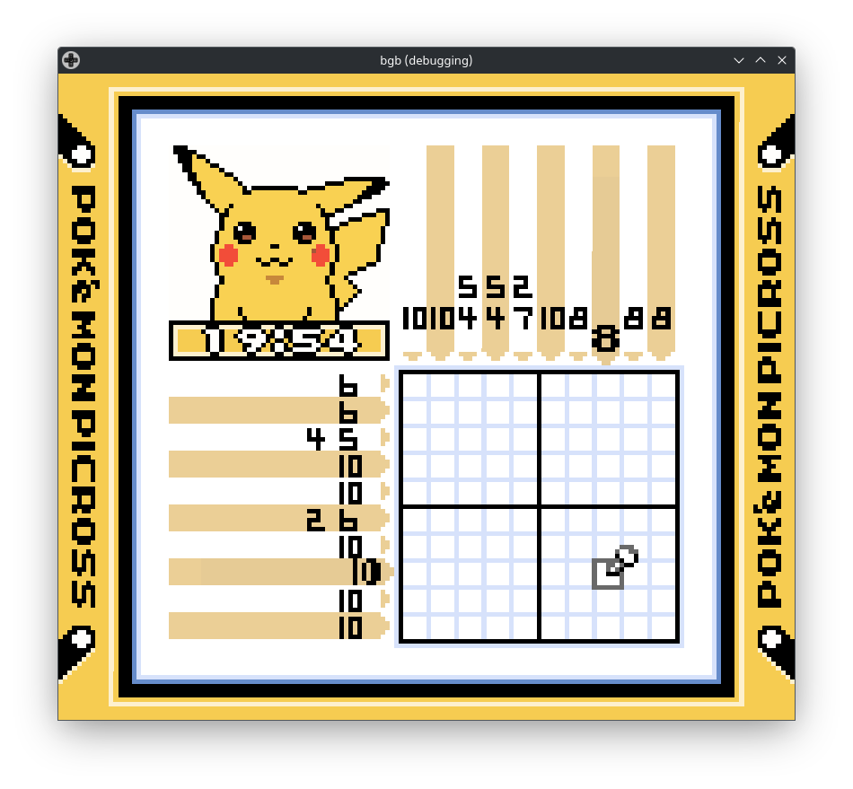

However, the more I played, the more I began to grow frustrated with one design element in particular. Each puzzle has a 20 minute timer, and in order to unlock later levels, you need to finish the puzzle under a par time, typically between 2-5 minutes. The penalty for making any mistake is quite harsh. One entire minute is taken from your remaining time on your first mistake. This is doubled to two minutes on your next mistake, then four minutes, and finally (if you have any time left), eight minutes on your fourth mistake onwards. Trying to maneuver as quickly as you can on a screen that fits in my palm with a Game Boy's D-pad is hard enough, but basically any mistake will require restarting the level. This game has over 150 levels, and this quickly grew to frustrate me. So much so, that I decided to do something about it.

I have previously made a Game Boy emulator, and this experience has given me just enough knowledge and confidence to be dangerous, so I decided to try and modify the game to fix this perceived issue. This article chronicles the journey I went on to accomplish this task. This is meant to be more of a retrospective than a general guide, but I hope it is useful for those interested in the fundamentals of completing a similar project.

A note on notation: I've denoted any hexadecimal values with an 'h' suffix, for example 1234h. You will sometimes see this written as 0x1234 or $1234 in other works, but I will only use the 'h' for this article.

## Reverse Engineering the Timer

The goal of this project is simple. Given a copy of *Pokemon Picross*, I want to edit the game so that the penalty timer is less harsh than one minute doubling for each mistake. Let's aim for having the penalty start out at a smaller time, perhaps 10 seconds for a mistake. We will begin by reverse engineering the game's timer to find the correct section of code to overwrite, in Game Boy assembly language. I know enough about Game Boy games to lay out the broad overview of the process.

1. Find the areas of RAM that stores the timer.
2. Watch the timer when we make a mistake to find the section of game code that handles mistakes.
3. Modify that section in the ROM (the game file) to be more lenient.

Those are our three steps. Not too daunting when laid out like this, although we will need some external tools to assist us. A lone Game Boy will not do much to help us here. There are several Game Boy emulators that have advanced debugging features, but I've decided to use *bgb*, which has arguably been the de facto debugging emulator for some time. *bgb* is a Windows-only program, but runs very well under Wine, which is fortunate for a Linux user like myself. It allows us to run the game while viewing the internal RAM data, so we can locate the section of memory that handles the in-game timer.

The game displays a four digit timer, two digits for the minutes and two for the seconds, which must have a corresponding section of RAM that handles it. Since the timer updates exactly once per second (assuming you aren't making any mistakes), its RAM data must also be written to once per second. There are several possible ways to encode a four digit timer. It could be the total number of seconds, separate entries for minutes and seconds, or separate entries for each digit. This choice was made by the original developers, and they each have their pros and cons. We won't know which they've chosen until we correctly identify the address.

*bgb* has a great feature I'm going to utilize called the "Cheat Searcher". The Cheat Searcher allows us to filter all of RAM from one moment to another, keeping or throwing out memory addresses that have changed. We can throw out any memory addresses that have changed while the timer value remained the same, or didn't change when the timer did. Very few values will change per second, so we can narrow down the potential candidates to a more manageable number pretty quickly, which we can then verify by hand.

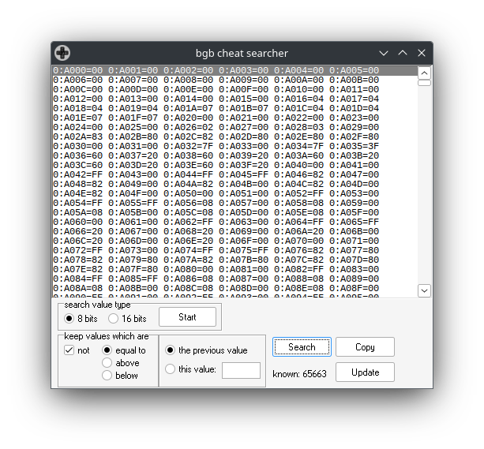

We want to keep memory addresses which are *not* the same as previously, so we'll enable that setting. I've started a new level, and each time the timer ticks down, I've pressed the "Search" button, which will eliminate more and more memory addresses. After doing this for about 10 seconds or so, I have a little over a dozen items still in the list that don't seem to be going anywhere, so let's see if we can't determine which of these is the right place ourselves.

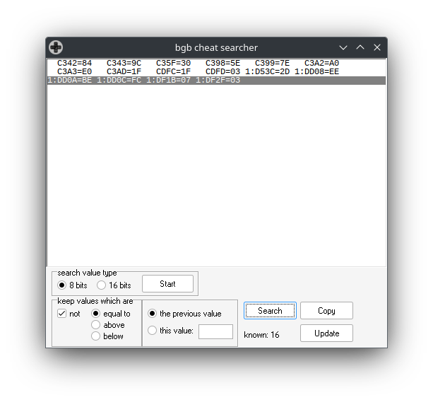

*bgb* will allow you to view those addresses in the debugger, where we can watch the values change live. Several of them change very rapidly, much more than once per second, and thus clearly aren't our target address. Some addresses do change in roughly the correct timescale, but don't seem to match our timer data at all, in any of the possible forms it could take. However, after checking through each of these values, I've finally found one that matches exactly what we're looking for. Memory address CDFDh, inside of Work RAM, ticks down exactly once per second. Looking at its neighboring bytes, a pattern quickly emerges. The third option I mentioned above, where each digit was given its own byte, seems to be the correct one, as the four digits of the timer are represented here. For example, if my timer had 16:35 left on it, then memory addresses CDFDh thru CE00h store 05h, 03h, 06h, 01h. The four digits of our timer, in reverse order. Checking the other remaining possibilities reveal that this is definitely the address we're looking for.

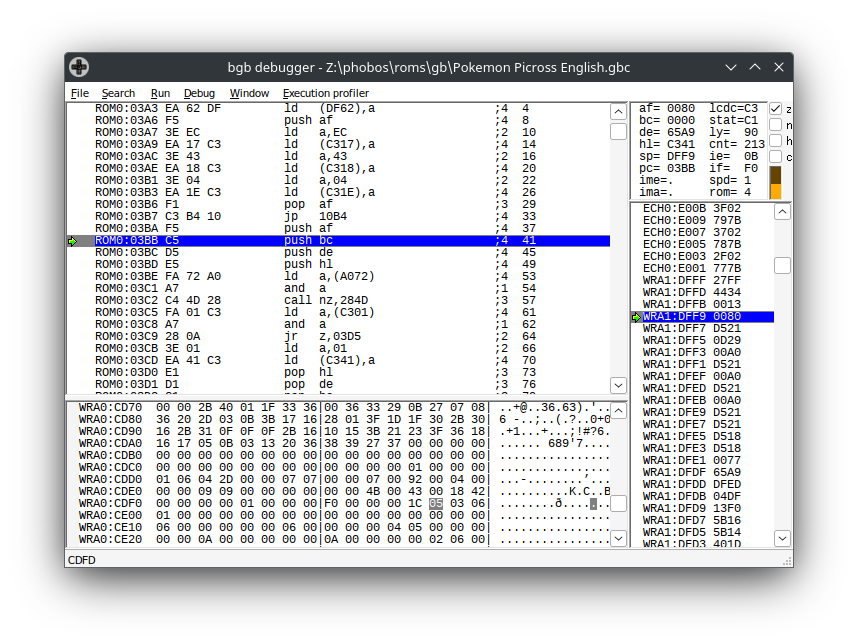

## Finding our function

We now have the ability to watch our timer count down in RAM, and with this, we can find the section of code that handles the penalties. In addition to the Cheat Search, *bgb* allows us to set "breakpoints" on any memory address. We can then halt the game anytime that memory address is written, read, or executed. In this case, we will want a write breakpoint; we want to know when one of the digits of our timer has changed. We need to be careful which digit we watch. We don't particularly care about the normal behavior of the timer, we want to find the penalty behavior. It doesn't do us much good to watch the second's digit, as it gets modified frequently by the normal passage of gameplay. Conveniently, making a mistake in the game penalizes us by one minute, meaning it's the minute digit that will get modified, at address CDFFh. This value normally only changes once per minute, giving us plenty of time to intentionally make a mistake in the game, triggering our breakpoint.

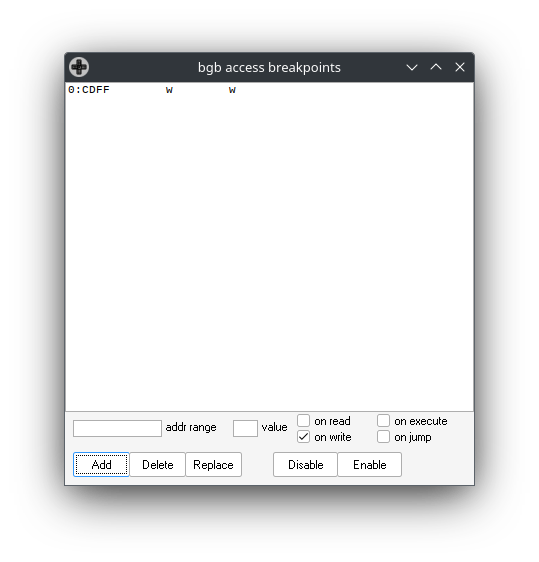

Upon doing so, the game should freeze as it attempts to subtract one minute off our time, with *bgb* helpfully pointing to a specific line in the debugger, which reads:

`R029:4824  EA FF CD  ld (CDFF), a`

This line is actually three separate pieces of information. First is `R029:4824`, which tells us that Game Boy execution was halted at memory address 4824h, inside of ROM bank 29h. We'll come back to what ROM banks are in a moment, as they'll be important for this project. Next, three bytes are displayed, `EA FF CD`, which are the three bytes making up the current instruction being executed, which *bgb* follows up by displaying in assembly language, `ld (CDFF), a`. This instruction takes the value stored in register A and stores it in memory address CDFFh. A register is a small allocation of data used directly by the CPU. When the CPU performs an operation, it is required to copy individual bytes into one of these registers before it can perform its operation. We'll need to read the neighboring instructions to get the full context of what this does, but it seems likely that the minute value post-penalty was stored in register A, and is now being placed back into the appropriate memory address.

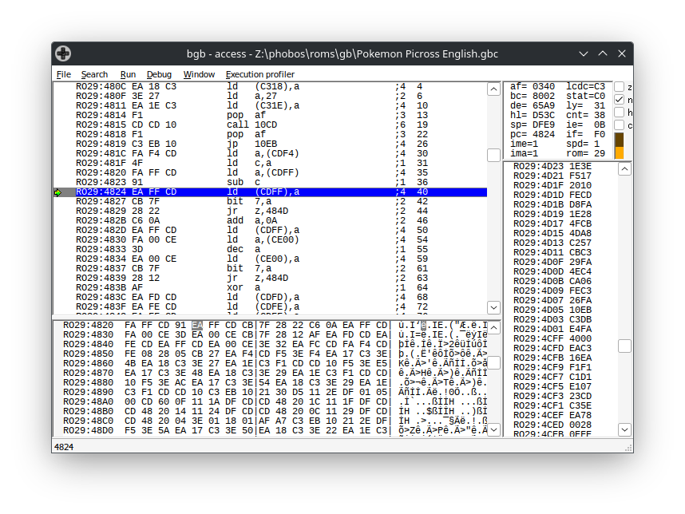

There is that business about ROM banks however. When a Game Boy game is running, it does not execute its instructions directly from the game cartridge. Instead, it needs to copy its data into RAM, where it then is executed. This presents a potential problem, as the Game Boy only allocates 32 KiB for game data, which even for the time was a very small amount of space. Some games (*Tetris* for example) do fit their entire game inside of 32 KiB, but for many developers, the ability to have games of a larger size would be required. To assist with this, the Game Boy hardware supports something known as "Bank Switching", where the game ROM would be broken into 16 KiB chunks, which could be swapped into and out as needed. The first 16 KiB of game ROM, bank 0, is always loaded in, but the developer has the ability to load any other banks in as they wish. In our case, the timer penalty function lives inside of Bank 29h of ROM.

Knowing about banks is important because while we have dealt only with the game's running RAM so far, it is the ROM data that we will need focus on to complete the project. The penalty code may live at memory address 4824h in RAM, but that's not where it will be located in our actual ROM file. There are two ways to find this correct address. The first would be to calculate the address, knowing how large each bank is, which bank we need to be in, and how far into that bank our code of interest lies. Each bank is 4000h bytes, we're interested in the 29h bank, and we need the data 824h bytes in (don't forget the first 4000h is always bank 0). This gives us an address of A4824h, which, if we compare that section of ROM data to what we see in RAM, matches exactly.

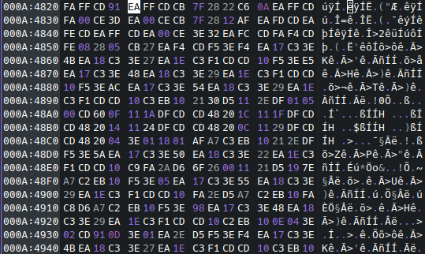

If you're averse to doing the math, there is another quick way to find it. If you search a long enough string of bytes, you'll only find a single match, the one we're looking for. By searching for the eight bytes starting at 4824h, I was able to find a single result, again at A4824h. It's nice when things work out!

Note: This business with bank switching means that several addresses can refer to the same section of code, based on context. There's the offset inside our ROM game file (A4824h), the bank address (bank 29h, offset 824h), and then the address when it's loaded in RAM (4824h, but only when bank 29h is loaded). This distinction can be somewhat confusing, and I'll try to mainly use the RAM address unless otherwise noted.

## GB Assembly for Dummies

 We have now located the section of our ROM file that we will need to understand and eventually edit. I don't imagine that many people can read raw hexadecimal, so the first step is to convert the game from its binary version into a more legible representation. To assist, I will call again upon another tool, *ghidra*, the NSA's open source reverse engineering program (yes *that* NSA). *ghidra* will attempt to convert our Game Boy hexadecimal code into a C-style high level language, which will be easier for us to read and understand. *ghidra* does not support Game Boy assembly out of the box, but some users have created an extension for its support. We will need to download and install the [GhidraBoy](https://github.com/Gekkio/GhidraBoy) extension (written by the same author as the excellent *SameBoy* emulator) to round out our installation.

Let's open *ghidra* and create a new project. We can import our *Pokemon Picross* ROM file, and *ghidra* will kindly break the game into the different ROM banks. Our section of code lives in bank 29h, which here is denoted in decimal as `rom41`. Although I told the project to auto-analyze the whole game, this bank hadn't been decompiled, and I had better luck selecting everything then disassembling via the right click menu. Once finished, let's verify that what *ghidra* is showing us matches up with what we know so far. Jump down to line `rom41:4824`, and we can see that the instruction at 4824h is `ea ff cd`, which matches what *bgb* told us. We appear to be in the right place.

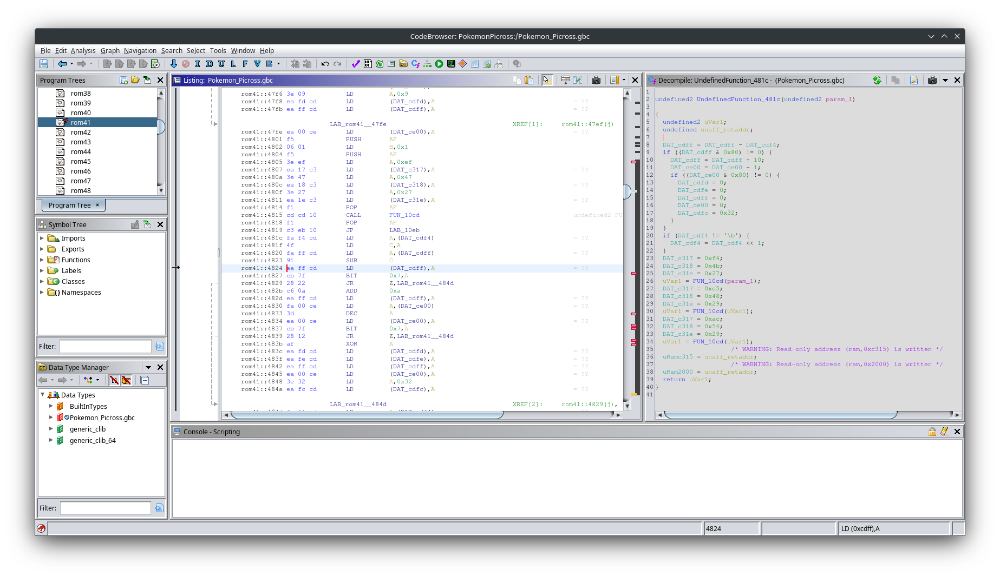

In addition to replacing the hexadecimal data with assembly language, *ghidra* has decompiled the function under the cursor into a C-like language, shown on the right hand side of the image above. It's done an okay job, but it doesn't have the context for what these memory addresses actually are. Fortunately, we know some of them, namely that CDFDh stores the seconds digit, CDFEh stores the ten seconds digit, CDFFh the minute digit, and CE00h the ten minute digit. In the disassembly, we can right click on one of these labels, for example `DAT_cdfd`, and use the Label command to replace it with a more recognizable name. After replacing all four, we can start to get a better idea of what's happening via the decompilation.

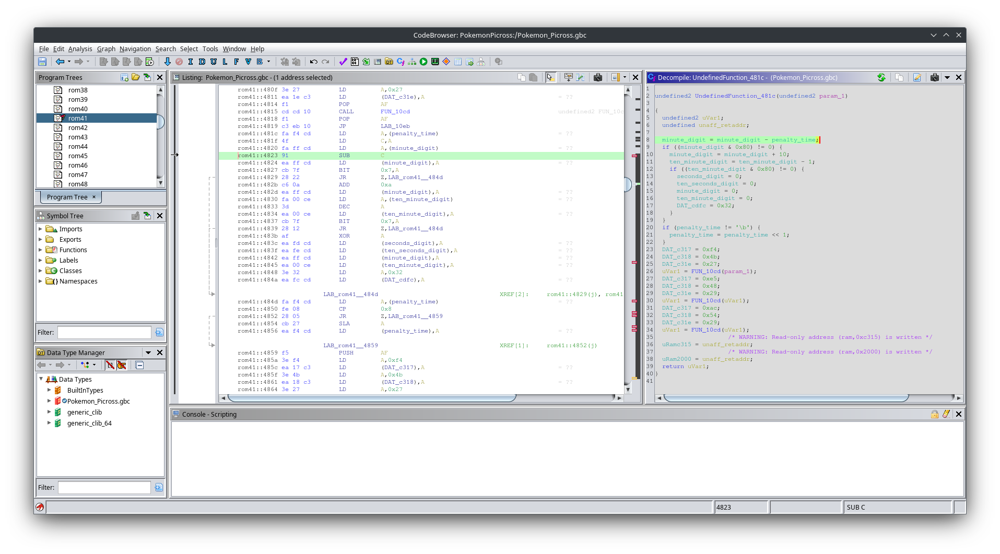

The part of the function that interests me is the logic towards the beginning, starting at 481Ch, with one small annotation I've added in. There is some additional logic at the end of this function, but it's concerned with setting memory we don't know anything about, so I've omitted it.

```c
minute_digit = minute_digit - DAT_cdf4;
if ((minute_digit & 0x80) != 0) {
  minute_digit = minute_digit + 10;
  ten_minute_digit = ten_minute_digit - 1;
  if ((ten_minute_digit & 0x80) != 0) {
    seconds_digit = 0;
    ten_seconds_digit = 0;
    minute_digit = 0;
    ten_minute_digit = 0;
    DAT_cdfc = 0x32;
  }
}
if (DAT_cdf4 != '\b') { /* Note: '\b' is equal to 8 */
  DAT_cdf4 = DAT_cdf4 << 1;
}
```

We begin by subtracting the value stored at CDF4h from our minute's digit, which seems awfully like a penalty time; we'll need to keep an eye on that. After that subtraction, the game ANDs our minute digit with 80h, and checks if that is non-zero. If you're new to low level operations, it may not be immediately clear what is happening here. It's important to remember that these are just raw numbers being stored in memory, the system is free to assign them any context it needs upon them. In this case, our `minute_digit` is being treated as a signed 8-bit value. By ANDing it with 80h, the game is checking if the most significant bit is 1, and thus is a negative value. Since the game uses this value as one digit of a larger number, a negative value here would mean we would need to borrow from the ten's place, and we can see that's exactly what the next two lines are doing. If our minute digit is negative, we borrow one from the ten's digit and increase our minute value by ten. Since we've subtracted from the ten's digit, we will need to repeat this process to see if it has gone below zero, which the next if statement performs. If that's true, then it means both our minute and ten minute values were below zero, and thus we are out of time. The game finishes up by putting zeroes in all four of our display values, and by writing 32h to memory address CDFCh, which I assume is some sort of game over flag.

The last if statement is relevant as well. It checks whether that value in CDF4h is equal to eight, and if not, it left shifts its value, effectively doubling it. Remember when I described the penalty system of this game? It begins at one minute, and with each mistake doubles until reaching a maximum penalty of eight minutes, which is exactly what we're seeing here. I am now certain that CDF4h holds our penalty time, and we can denote it in *ghidra* as such.

With this knowledge in hand, we can finally begin rewriting the game to change the penalty. Our stated goal was to try and make the penalty start at only 10 seconds. Rather than subtract from the `minute_digit` value then, we will need to subtract from `ten_seconds_digit`, and we'll need to perform an additional borrow check if it becomes negative. Let's start by rewriting the decompiled code to obey our behavior.

```c
ten_seconds_digit = ten_seconds_digit - penalty_time;
if ((ten_seconds_digit & 0x80) != 0) {
  ten_seconds_digit = ten_seconds_digit + 6;
  minute_digit = minute_digit - 1;
  if ((minute_digit & 0x80) != 0) {
    minute_digit = minute_digit + 10;
    ten_minute_digit = ten_minute_digit - 1;
    if ((ten_minute_digit & 0x80) != 0) {
      seconds_digit = 0;
      ten_seconds_digit = 0;
      minute_digit = 0;
      ten_minute_digit = 0;
      DAT_cdfc = 0x32;
    }
  }
}
if (penalty_time != 8) {
  penalty_time = penalty_time << 1;
}
```

This ended up being a pretty minor change all things considered. We subtract the `penalty_time` from `ten_seconds_digit` rather than `minute_digit`, and add an additional borrow check. It's important to note that we don't add 10 to `ten_seconds_digit` upon a borrow, only 6, as there are only 60 seconds in a minute.

However, I'm afraid I must bring some bad news, as there is a bug in that code we've written. Right now, our penalty will begin at 10 seconds, then double to 20, 40, and finally 80 seconds. It's that 80 second penalty that poses a problem. If we were to go subtracting a `penalty_time` of 8 from our `ten_seconds_digit`, it wouldn't just go negative, it could go so negative that we would need to borrow twice from `minute_digit` to become positive again, which is something our code doesn't handle. I think if you were feeling very clever, it's possible to rewrite this function to handle that, but instead I would propose to just... not do any of that. We're already making the game easier, let's just make 40 seconds be the worst penalty, which our function will be able to correctly handle in all cases.

Our final modification would then look like this:

```c
ten_seconds_digit = ten_seconds_digit - penalty_time;
if ((ten_seconds_digit & 0x80) != 0) {
  ten_seconds_digit = ten_seconds_digit + 6;
  minute_digit = minute_digit - 1;
  if ((minute_digit & 0x80) != 0) {
    minute_digit = minute_digit + 10;
    ten_minute_digit = ten_minute_digit - 1;
    if ((ten_minute_digit & 0x80) != 0) {
      seconds_digit = 0;
      ten_seconds_digit = 0;
      minute_digit = 0;
      ten_minute_digit = 0;
      DAT_cdfc = 0x32;
    }
  }
}
if (penalty_time != 4) {
  penalty_time = penalty_time << 1;
}
```

## From C to shining ASM

We now have the modification written out in a higher level language, and we need to apply this change to the ROM itself. We're faced with a few challenges. All of those memory addresses we've seen throughout the game are hardcoded in. Unless we keep the code the exact same length as it was before -- and we've already seen it won't be -- many of those memory address would now be skewed to the wrong place, at least for this ROM bank. It is possible to overwrite some of the instructions in *ghidra*, and let it attempt to fix the issues, but it won't be able to handle inserting new code well, and even if it did, *ghidra* doesn't support exporting a modified Game Boy ROM. Perhaps if you're reading this far enough into the future it can be done correctly, but since this is a relatively simple change, we'll do it by hand. It wouldn't be much of a Game Boy hack if we didn't do at least some assembly modification.

Let's start by converting the modifications we made from the high level language to assembly. Fortunately, the changes we made only involved adding new code or making simple changes, so we should be able to extrapolate from what was originally there. According the *ghidra*, the original assembly for this function reads like this:

```asm
; Address 481Ch
LD A,(penalty_time)       ; Load the penalty time out of RAM into the A register
LD C,A                    ; Move the penalty from the A to C register
LD A,(minute_digit)       ; Load the minute digit from RAM into the A register
SUB C                     ; Minute digit -= Penalty time
LD (minute_digit),A       ; Store the adjusted value back into RAM
BIT 0x7,A                 ; Keep only the left bit to check if it is positive
JR Z,LAB_rom41__484d      ; If it is, skip to next section, otherwise keep going
ADD 0xa                   ; Since it's negative, borrow a 10
LD (minute_digit),A       ; Store it back into RAM
LD A,(ten_minute_digit)   ; Load in the ten minute digit
DEC A                     ; Subtract 1 from it, since we borrowed
LD (ten_minute_digit),A   ; Store it back into RAM
BIT 0x7,A                 ; Check if the ten minute digit is positive
JR Z,LAB_rom41__484d      ; If it is, skip to next section, otherwise keep going
XOR A                     ; If it's negative, time is over, so use clever method to set A to 0
LD (seconds_digit),A      ; Load 0 into the second digit
LD (ten_seconds_digit),A  ; Load 0 into the ten second digit
LD (minute_digit),A       ; Load 0 into the minute digit
LD (ten_minute_digit),A   ; Load 0 into the ten minute digit
LD A,0x32                 ; Load 50 into the A register
LD (DAT_cdfc),A           ; Store it into CDFCh (probably a game over flag)

label LAB_rom41__484d:
LD A,(penalty_time)       ; Load penalty time out of RAM into A
CP 0x8                    ; Check if penalty time is equal to 8
JR Z,LAB_rom41__4859      ; If it's not, leave, otherwise continue
SLA A                     ; Since it's not 8, double it
LD (penalty_time),A       ; Store penalty time back into RAM
```

The changes we need to make are subtracting from `ten_second_digit` in beginning and adding another round of positive checks, and making 4 the maximum value of `penalty_time`.

```asm
LD A,(penalty_time)       ; Load the penalty time out of RAM into the A register
LD C,A                    ; Move the penalty from the A to C register
LD A,(ten_second_digit)   ; Load the ten second digit from RAM into the A register
SUB C                     ; Ten second digit -= Penalty time
LD (ten_second_digit),A   ; Store the adjusted value back into RAM
BIT 0x7,A                 ; Keep only the left bit to check if it is positive
JR Z,LAB_rom41__484d      ; If it is, skip to next section, otherwise keep going
ADD 0x6                   ; Since it's negative, borrow by adding 6
LD (ten_second_digit),A   ; Store it back into RAM
LD A,(minute_digit)       ; Load in the minute digit
DEC A                     ; Subtract 1 from minute digit since we borrowed
LD (minute_digit),A       ; Store minute digit back into RAM
BIT 0x7,A                 ; Keep only the left bit to check if it is positive
JR Z,LAB_rom41__484d      ; If it is, skip to next section, otherwise keep going
ADD 0xa                   ; Since it's negative, borrow by adding 10
LD (minute_digit),A       ; Store minute digit back into RAM
LD A,(ten_minute_digit)   ; Load the ten minute digit
DEC A                     ; Subtract 1 to complete the borrow
LD (ten_minute_digit),A   ; Store the ten minute digit back into RAM
BIT 0x7,A                 ; Keep only the left bit to check if it is positive
JR Z,LAB_rom41__484d      ; If it is, skip to next section, otherwise continue
XOR A                     ; This is the game over section. Set A register to 0
LD (seconds_digit),A      ; Set seconds digit to 0
LD (ten_seconds_digit),A  ; Set ten seconds digit to 0
LD (minute_digit),A       ; Set minute digit to 0
LD (ten_minute_digit),A   ; Set ten minute digit to 0
LD A,0x32                 ; Load 50 into A register
LD (DAT_cdfc),A           ; Write 50 to CDFCh

label LAB_rom41__484d:
LD A,(penalty_time)       ; Load penalty time into A
CP 0x4                    ; Check if penalty time is equal to 4
JR Z,LAB_rom41__4859      ; If it is, leave, otherwise continue
SLA A                     ; Double the penalty time
LD (penalty_time),A       ; Store new penalty time back into RAM
```

Now that we've taken the time to convert the complete function, we can see that quite a few instructions are actually unchanged. In fact, the only changes we've made are replacing the '8' with a '4' for the penalty time, and then replacing the two lines

```asm
LD A,(minute_digit)
SUB C
```

with

```asm
LD A,(ten_second_digit)
SUB C
LD (ten_second_digit),A
BIT 0x7,A
JR Z,LAB_rom41__484d
ADD 0x6
LD (ten_second_digit),A
LD A,(minute_digit)
DEC A
```

Replacing an 8 with a 4 is a trivial change, so all that really remains is replacing the code above. First, let's convert our new section of code into its raw hexadecimal. There are various tools online available to do this, or you can do as I did and base it off what *ghidra* provides. The one operation that isn't obvious is the `JR` "jump relative" instruction which is used for our if statements. It tells the CPU to jump forward X number of bytes. The instances from the original code are unchanged, but our newly introduced `JR` statement will need to jump forward 50 bytes (32h), which I calculated by counting backwards after writing out all the other values.

```asm
LD A,(ten_second_digit)   ; FA FE CD
SUB C                     ; 91
LD (ten_second_digit),A   ; EA FE CD
BIT 0x7,A                 ; CB 7F
JR Z,LAB_rom41__484d      ; 28 32
ADD 0x6                   ; C6 06
LD (ten_second_digit),A   ; EA FE CD
LD A,(minute_digit)       ; FA FF CD
DEC A                     ; 3D
```

Where the original game had four bytes of code, we need to have twenty. While you might be tempted to simply insert this data directly into place, recall an issue I mentioned previously. As we saw when we converted our own code to hex, the jump operations use either relative offsets or hardcoded addresses to encode their destination. If we insert the extra sixteen bytes right here, any code that references an address in the latter part of the bank will be off by sixteen bytes. This will almost certainly cause catastrophic issues.

To address this, you might imagine that we would need to modify jump instruction by instruction, correcting any offsets we find. This would be not only tedious but incredibly error-prone. Instead, we're going to exploit a quirk in the makeup of the game to our advantage. While I mentioned that ROM banks each had a size of exactly 16 KiB, in almost all cases a bank of code wouldn't fit in exactly 16 KiB, and instead have a little bit of unused space left over. To align the banks in the overall game ROM the way they need to be, dummy "padding" data was appended to the end. We have been interested in bank 29h, which extends from A4000h to A7FFFh, but you'll notice that beginning at address A7C6Dh, all the remaining data is simply FFh. (For this game, the section of FFh bytes extends much further, but that's crossing over into entire unused banks). Given that there's no actual code or assets here, the unmodified game never accesses this section, meaning we can modify it to our heart's content without any risk of altering pre-existing behavior.

Since we can't insert our new functionality where it was before, we shall paste the hexadecimal code into the middle of this padding. I've chosen address A7D00h (7D00h in RAM) as a nice round number, but any address inside the padding would work. We will access this code via the `JP nn` instruction (opcode CDh), and then return to the original code the same way. This does add two additional instructions to the original game, but I think the slight hit to performance is acceptable.

We're now looking at two different areas of code, so let's begin with the final modification to the original section. Only the lines that have changed have a comment explaining why.

```asm
LD A,(penalty_time)
LD C,A
JP 7D00h                    ; C3 00 7D - Replace the three bytes for the load with three bytes for the jump.
NOP                         ; 00       - No longer want to SUB C here, we'll do that below. Place an unused instruction here instead.
LD (minute_digit),A
BIT 0x7,A
JR Z,LAB_rom41__484d
ADD 0xa
LD (minute_digit),A
LD A,(ten_minute_digit)
DEC A
LD (ten_minute_digit),A
BIT 0x7,A
JR Z,LAB_rom41__484d
XOR A
LD (seconds_digit),A
LD (ten_seconds_digit),A
LD (minute_digit),A
LD (ten_minute_digit),A
LD A,0x32
LD (DAT_cdfc),A

label LAB_rom41__484d:
LD A,(penalty_time)
CP 0x4                      ; FE 04    - Don't forget, we need to change this to a 4.
JR Z,LAB_rom41__4859
SLA A
LD (penalty_time),A
```

That's it, just three instructions changed in the original block. One to redirect the flow to where we're going to store the extra required data, one to make sure we're using up the same number of bytes, and finally that correction of 8 to 4. Our replacement code can live amongst the padding, with an extra `JP` instruction so the program returns back to where it needs to be.

```asm
; Address 7D00h
LD A,(ten_second_digit)   ; FA FE CD
SUB C                     ; 91
LD (ten_second_digit),A   ; EA FE CD
BIT 0x7,A                 ; CB 7F
JP Z,484Dh                ; CA 4D 48
ADD 0x6                   ; C6 06
LD (ten_second_digit),A   ; EA FE CD
LD A,(minute_digit)       ; FA FF CD
DEC A                     ; 3D
JP 4824h                  ; C3 24 48
```

I made two changes here. The first is to replace the `JR Z, LAB_rom_41__484d` with a `JP` instruction. These accomplish the same thing, but a `JR` *relative* jump can only jump a maximum of 128 bytes. We will need to go a lot farther than that, so we'll just use the exact address, conveniently provided by our label. We also need to jump back to where we left off, just after the `NOP` instruction, and I'll save you the trouble by telling you this will be address 4824h, so we'll encode that in the final instruction.

### Finishing up

Time to test our theory. Duplicate your copy of the game ROM, and open one of them in your hex editor. The four bytes we want to replace are at A4820h. Overwrite them with `C3 00 7D 00`. Next, we will replace the `8` at A4851h with a `4`, as discussed. Now jump down to A7D00h, which should be a large section of FFh values. Beginning here, enter in the extra function bytes we've created -- `FA FE CD 91 EA FE CD CB 7F CA 4D 48 C6 06 EA FE CD FA FF CD 3D C3 28 48`. Side note for those interested in playing this game -- although this guide has assumed that you've been using an unmodified version of the game, the hack we've just created will work just fine with the English translation patch. This is a rather small modification that luckily doesn't interfere with any of the changes that other patch makes.

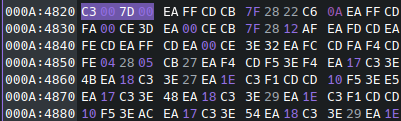

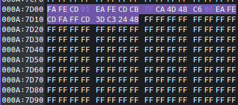

Load your modified ROM into your Game Boy emulator of choice and fire it up. Once you get past the lengthy introduction dialogue, you can test our hack by making an intentional mistake on any level. You'll notice that instead of incurring a minute penalty, you will only lose 10 seconds. Keep making mistakes and you'll see a 20 second, then 40 second penalty. You can make as many mistakes as you like to see 40 seconds repeatedly taken away from the timer, all the way down to zero. Much better than an eight minute penalty!

### Final notes

This method of hacking is not the only way to accomplish this task. Tools exist to perform much of this editing without the need of opening a hex editor at all. However, I wanted this article to not be about how to use a specific tool, but to give a general overview of the thought involved in completing a project of this type.

Assuming we wanted to share our creation with others, there is one final (thankfully simple) step that would be required. Nintendo is infamously litigious about their products, and they do not take kindly to them being distributed over the internet, even if they are modified versions of a game they never released. To that end, it is common to distribute *patch files* rather than the modified originals. These patches are simply encoded itemized lists of all the changed bytes and their locations that can be automatically applied to convert an unmodified game into our adjusted one. Several different standards exist, each with their own advantages, but for simple changes to small games, the [IPS standard](https://zerosoft.zophar.net/ips.php) is commonly used. Tools such as [this one](https://www.romhacking.net/patch/) can take the original game and your modified one, and produce a patch file that can be applied by the end user in reverse.
